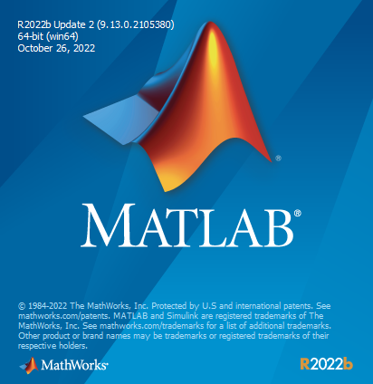
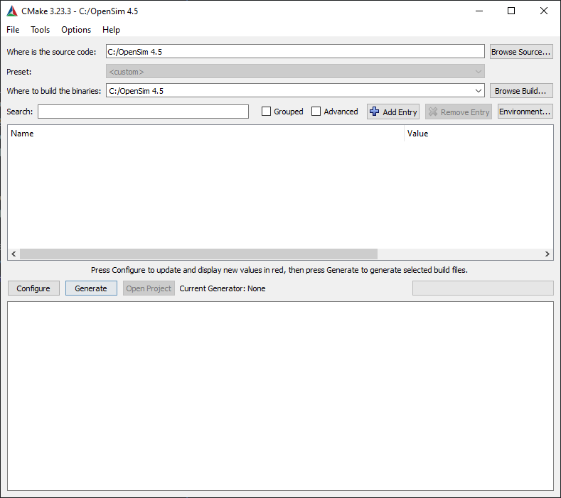
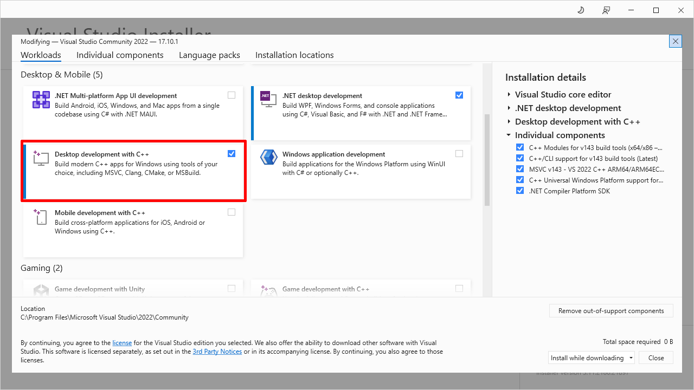
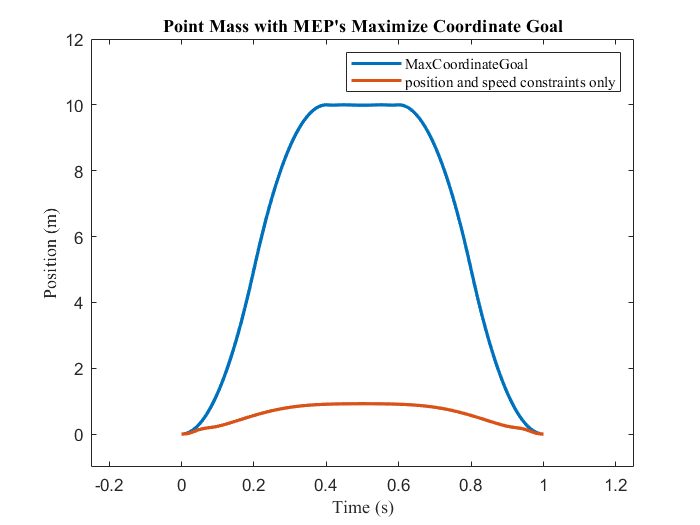

[](https://joss.theoj.org/papers/ab4ece70adece3811308955d52be6a2f)
[](https://www.gnu.org/licenses/gpl-3.0)


# Table of contents

- [Summary](#summary)
- [Setup](#setup)
- [Getting Started](#getting-started)
- [Testing](#testing)
- [License](#license)
- [Contributing](#contributing)
- [Code of Conduct](#code-of-conduct)

# Summary<a name="summary"></a>

MocoExtendProblem (`MEP`) is a framework to rapidly develop novel goals for biomechanical optimal control problems using OpenSim Moco and MATLAB (The Mathworks, Inc., Natick, MA, USA). `MEP` features several templates for testing and prototyping novel MocoGoals. In lieu of rebuilding OpenSim or generating an .omoco file from C++ to load the problem into MATLAB, users structure custom goals, build them, and call custom goals from MATLAB scripts.

# Setup and Requirements<a name="setup"></a>
- `MEP` was developed with Windows in mind, MacOS and linux are not supported at this time.
- `MEP`supports OpenSim versions 4.5 and has compatability for OpenSim 4.2-4.4, but does not support OpenSim versions below 4.2.
- `MEP` runs on MATLAB (tested on 2022a and above) and was tested with [visual studio 2019+](https://visualstudio.microsoft.com) as well as [CMake 3.23.3+](https://cmake.org/download/)
  


`MEP` was tested with cmake version 3.23.3, Matlab 2022b, and visual studio 2022 with Desktop development with C++.




- be sure to use visual studio installer's modify menu to install the workload for Desktop Development with C++.
  



- Download and install an OpenSim version from 4.2-4.5 from [SimTK](https://simtk.org) and follow the documentation for setting up OpenSim’s [MATLAB scripting environment](https://opensimconfluence.atlassian.net/wiki/spaces/OpenSim/pages/53089380/Scripting+with+Matlab).
- Follow the instructions (OpenSim) to download necessary dependencies for both MATLAB Scripting and C++ development.
- In MATLAB, configure MEX by running `mex -setup C++` in the MATLAB command window to use MS VisualStudio 2019+.

# Getting Started<a name="getting-started"></a>

## Compile MEX interface

From the top-level directory (`MocoExtendProblem`) there is a `build.m` script. Running this script will regenerate the `ExtendProblem` class and the MEX interface. Each time any goal implementations need to be changed/updated, build.m should be run. NOTE: building and testing the class requires being in the top-level directory (`MocoExtendProblem`); however, after the build is successful, you are free to add the `bin\relwithdebinfo` to your matlab path so you can access `MEP` outside the top-level directory.

The preferred method of including `MEP` to a new or existing project is to fork and add it as a submodule to your project. This way you can add your own custom goals with version control managed within your lab.

## Creating a new goal

1. OpenSim 4.5+ users should copy and paste a goal to serve as a template in the `custom_goals` directory such as MocoActivationGoal, while 4.2-4.4 users should copy and paste a goal in `custom_goals_compat`.
2. Replace mentions of the original goal name to that of your new custom goal name in each of the 5 files and file names, being careful to also modify the include guards in the osimGoalNameDLL.h and RegisterTypes_osimGoalName.h header files. 
3. In the MocoGoalNameGoal.cpp and MocoGoalNameGoal.h, reimplement `constructProperties()`, `initializeOnModelImpl()`, `calcIntegrandImpl()`, `calcGoalImpl()` such that they describe your custom goal.

To incorporate extend_problem goals into an existing MATLAB script, a C-style pointer to the instantiated MocoProblem is passed as a constructor argument to the `extend_problem.m` class that wraps the `MEP` MEX. Class methods of `extend_problem.m` are then used to add custom goals to the MocoProblem. In your matlab script using moco, after instantiating a MocoProblem, add the following 3 lines to pass the c-style pointer to your MocoProblem to the ExtendProblem class constructor and call the addMocoGoalName method to inject your custom goal into your problem. For additional examples see the test subdirectory.

```C++
cptr = uint64(problem.getCPtr(problem));
ep = extend_problem(cptr);
ep.addMocoCustomGoal('custom_goal',weight,power,divide_by_distance);
```

# Testing<a name="testing"></a>

In the test subdirectory, we have provided some test scripts to be run with MATLAB desktop GUI:
- `test_ExtendProblem_simple.m` - runs a simulation with the Max Coordinate Goal with result depicted below.
- `example2DWalking/WalkSim_Tracking.m` -runs a tracking simulation with MEP
- `example2DWalking/WalkSim_predictive.m` - runs a predictive simulation with MEP
- `driver.m` - a driver program for selecting the simulation type and if the simulation is tracking or predictive (for regenerating results from the Manuscript)



Additionally, if using an opensim version that is lower than 4.5, there are compatibility versions of `WalkSim_predictive.m` and `test_extendProblem_simple.m` to handle OpenSim version 4.2-4.4. The output of these scripts are compared against an OutputReference within the `MocoExtendProble\output` directory. Note: you should stay on the top-level directory `MocoExtendProblem`.

# License<a name="license"></a>

MEP is provided under:
[](https://opensource.org/license/mit)

# Contributing<a name="contributing"></a>

Please read our [contributing guidelines](CONTRIBUTING.md).

# Code of Conduct

See [CODE_OF_CONDUCT](CODE_OF_CONDUCT.md).
