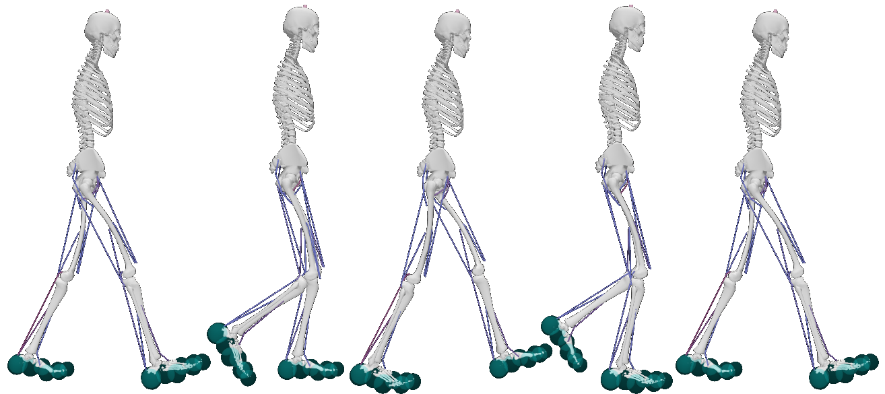

[](https://joss.theoj.org/papers/ab4ece70adece3811308955d52be6a2f)
[](https://www.gnu.org/licenses/gpl-3.0)

# MocoExtendProblem



# Table of contents
- [Project Summary](#Summary)  
- [Setup](#Installation)  
- [Getting started](#Start)
- [Testing](#Test)
- [License](#License)  
- [Contributing](#Contributing)  
- [Code of conduct](#CodeOfConduct)  

# Summary <a name="Summary"></a>

MocoExtendProblem (`MEP`) is a framework to rapidly develop novel goals for biomechanical optimal control problems using OpenSim Moco and MATLAB (The Mathworks, Inc., Natick, MA, USA). `MEP` features several templates for testing and prototyping novel MocoGoals in lieu of rebuilding OpenSim or generating an .omoco file from C++ to load the problem into MATLAB. Instead, users structure custom goals, build them, and call custom goals from MATLAB scripts.

# Setup <a name="Installation"></a>

- Download and install OpenSim from [SimTK](https://simtk.org) and follow the documentation for setting up OpenSim’s MATLAB scripting environment.
- Follow the instructions (OpenSim) to download necessary dependencies for both scripting in MATLAB and C++ development.
- In MATLAB, configure MEX with mex -setup C++ to use the MS VisualStudio 2019+.

# Getting started <a name="Start"></a>

To create a new goal with `MEP`: 

1. OpenSim 4.5+ users should copy a goal in the `custom_goals` directory while 4.2-4.4 users  should copy a goal in `custom_goals_compat`.
2. Replace mentions of the original goal name to that of your new custom goal name in each of the 5 files and file names, being careful to also modify the include guards in the dll and register types header files. 
3. Reimplement constructProperties(), initializeOnModelImpl(), calcIntegrandImpl(), calcGoalImpl() such that they describe your custom goal.

To incorporate extend_problem goals into an existing MATLAB script, a C-style pointer to the instantiated MocoProblem is passed as a constructor argument to the `extend_problem.m` class that wraps the `MEP` MEX. Class methods of `extend_problem.m` are then used to add custom goals to the MocoProblem.

```C++
cptr = uint64(problem.getCPtr(problem));
ep = extend_problem(cptr);
ep.addMocoCustomGoal('custom_goal',weight,power,divide_by_distance);
```

# Testing <a name="Test"></a>
blah blah blah
# License <a name="License"></a>
MEP is provided under:
[](https://www.gnu.org/licenses/gpl-3.0). The [license file](https://github.com/gibbonCode/GIBBON/blob/master/LICENSE) is found on the GitHub repository.

# Contributing <a name="Contributing"></a>
Please read our [contributing guidelines](CONTRIBUTING.md).

# Code of conduct <a name="CodeOfConduct"></a>
See [CODE_OF_CONDUCT](CODE_OF_CONDUCT.md)
