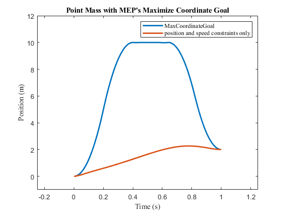

[](https://joss.theoj.org/papers/ab4ece70adece3811308955d52be6a2f)
[](https://www.gnu.org/licenses/gpl-3.0)


# Table of contents

- [Summary](#summary)
- [Setup](#setup)
- [Getting Started](#getting-started)
- [Testing](#testing)
- [License](#license)
- [Contributing](#contributing)
- [Code of Conduct](#code-of-conduct)

# Summary<a name="summary"></a>

MocoExtendProblem (`MEP`) is a framework to rapidly develop novel goals for biomechanical optimal control problems using OpenSim Moco and MATLAB (The Mathworks, Inc., Natick, MA, USA). `MEP` features several templates for testing and prototyping novel MocoGoals. In lieu of rebuilding OpenSim or generating an .omoco file from C++ to load the problem into MATLAB, users structure custom goals, build them, and call custom goals from MATLAB scripts.

# Setup and Requirements<a name="setup"></a>
- `MEP` was developed with Windows in mind, MacOS and linux are not supported at this time.
- `MEP`supports OpenSim versions 4.5 and has compatability for OpenSim 4.2-4.4, but does not support OpenSim versions below 4.2.
- `MEP` runs on MATLAB (tested on 2022a and above) and was tested with [visual studio 2019+](https://visualstudio.microsoft.com) as well as [CMake 3.23.3+](https://cmake.org/download/)
  


`MEP` was tested with cmake version 3.23.3, Matlab 2022b, and visual studio 2022 with Desktop development with C++.


- be sure to use visual studio installer's modify menu to install the workload for Desktop Development with C++.
  


- Download and install an OpenSim version from 4.2-4.5 from [SimTK](https://simtk.org) and follow the documentation for setting up OpenSim’s [MATLAB scripting environment](https://opensimconfluence.atlassian.net/wiki/spaces/OpenSim/pages/53089380/Scripting+with+Matlab).
- Follow the instructions (OpenSim) to download necessary dependencies for both MATLAB Scripting and C++ development.
- In MATLAB, configure MEX by running `mex -setup C++` in the MATLAB command window to use MS VisualStudio 2019+.

# Getting Started<a name="getting-started"></a>

## Compile MEX interface

From the top-level directory (`MocoExtendProblem`) there is a `build.m` script. Running this script will regenerate the `ExtendProblem` class and the MEX interface. Each time any goal implementations need to be changed/updated, build.m should be run. NOTE: building and testing the class requires being in the top-level directory (`MocoExtendProblem`); however, after the build is successful, you are free to add the `bin\relwithdebinfo` to your matlab path so you can access `MEP` outside the top-level directory.

The preferred method of including `MEP` to a new or existing project is to fork and add it as a submodule to your project. This way you can add your own custom goals with version control managed within your lab.

## Creating a new goal

1. OpenSim 4.5+ users should copy and paste a goal to serve as a template in the `custom_goals` directory such as MocoActivationGoal, while 4.2-4.4 users should copy and paste a goal in `custom_goals_compat`.
2. Replace mentions of the original goal name to that of your new custom goal name in each of the 5 files and file names, being careful to also modify the include guards in the osimGoalNameDLL.h and RegisterTypes_osimGoalName.h header files. 
3. In the MocoGoalNameGoal.cpp and MocoGoalNameGoal.h, reimplement `constructProperties()`, `initializeOnModelImpl()`, `calcIntegrandImpl()`, `calcGoalImpl()` such that they describe your custom goal.

To incorporate extend_problem goals into an existing MATLAB script, a C-style pointer to the instantiated MocoProblem is passed as a constructor argument to the `extend_problem.m` class that wraps the `MEP` MEX. Class methods of `extend_problem.m` are then used to add custom goals to the MocoProblem. In your matlab script using moco, after instantiating a MocoProblem, add the following 3 lines to pass the c-style pointer to your MocoProblem to the ExtendProblem class constructor and call the addMocoGoalName method to inject your custom goal into your problem. For additional examples see the test subdirectory.

```C++
cptr = uint64(problem.getCPtr(problem));
ep = extend_problem(cptr);
ep.addMocoCustomGoal('custom_goal',weight,power,divide_by_distance);
```

## Tutorial


first clone MocoExtend Problem.
```
git clone git@github.com:Aravind-Sundararajan/MocoExtendProblem.git
```
Next, open MATLAB and run build.m to see that your setup is working.


After building, you should see the following in the command window:


To build a new goal, we are going to copy a goal folder to serve as a template, I'll call this new goal MocoCustomGoal.


We need to change the naming conventions of the 5 files (GoalName.cpp, GoalName.h, osimGoalNameDLL.h, RegisterTypes_osimGoalName.cpp, RegisterTypes_osimGoalName.h) from MocoActivationGoal to MocoCustomGoal
You can do this by hand or using an ide/editor like vscode or notepad++.


We also need to change the  naming conventions within each of the files. This is relatively easy to regex replace or find&replace with vscode, but also not challenging by hand either. I am going to do this with vscode. You should have 45 replacements across the 5 files. (Note I am checking the box for Preserve Case so I can change the class names and includeguards in one go.)


Now let's run build.m again and make sure our new MocoCustomGoal works.


If we look in the bin/RelWithDebInfo directory, we will see that our new custom goal has been created.


And if we check `bin/RelWithDebInfo/extend_problem.m` you will see we have a new method for adding the MocoCustomGoal to a MocoProblem.


Let's try adding MocoCustomGoal to a problem. Quickly we can edit `test\test_ExtendProblem_simple.m`

Comment line 81, and add a new line `ep.addMocoCustomGoal('custom_goal',1.0, true, false, false, false);` To know what the boolean arguments do, see the interface that we just lookled at (`bin/RelWithDebInfo/extend_problem.m`)


Now if we hit run, and Add to Path, we should see 

```
Adding MocoCustomGoal goal

List of user-set options:

                                    Name   Value                used
                   hessian_approximation = limited-memory        yes
                      print_user_options = yes                   yes
This is Ipopt version 3.12.8, running with linear solver mumps.
NOTE: Other linear solvers might be more efficient (see Ipopt documentation).

Number of nonzeros in equality constraint Jacobian...:     2884
Number of nonzeros in inequality constraint Jacobian.:        0
Number of nonzeros in Lagrangian Hessian.............:        0

Total number of variables............................:      599
                     variables with only lower bounds:        0
                variables with lower and upper bounds:      599
                     variables with only upper bounds:        0
Total number of equality constraints.................:      500
Total number of inequality constraints...............:        0
        inequality constraints with only lower bounds:        0
   inequality constraints with lower and upper bounds:        0
        inequality constraints with only upper bounds:        0

Warning: intermediate_callback is disfunctional in your installation. You will only be able to use stats(). See https://github.com/casadi/casadi/wiki/enableIpoptCallback to enable it.
iter    objective    inf_pr   inf_du lg(mu)  ||d||  lg(rg) alpha_du alpha_pr  ls
   0  0.0000000e+00 1.99e+00 0.00e+00   0.0 0.00e+00    -  0.00e+00 0.00e+00   0
   1  0.0000000e+00 3.55e-15 9.58e+00   0.3 2.34e+01    -  9.13e-01 1.00e+00f  1
   2  0.0000000e+00 3.55e-15 9.58e-02  -4.6 6.53e-06    -  9.90e-01 1.00e+00h  1
   3  0.0000000e+00 1.29e-11 7.57e-02  -0.7 1.45e+03    -  2.10e-01 1.62e-01f  1
   4  0.0000000e+00 1.50e-11 4.15e-03  -1.4 6.61e+01    -  9.45e-01 1.00e+00f  1
   5  0.0000000e+00 6.00e-12 4.36e-04  -2.1 4.10e+01    -  8.95e-01 1.00e+00f  1
   6  0.0000000e+00 3.24e-12 2.51e-05  -3.1 1.10e+01    -  9.42e-01 1.00e+00f  1
   7  0.0000000e+00 7.11e-15 2.35e-06  -4.6 2.35e-06    -  1.00e+00 1.00e+00h  1
   8  0.0000000e+00 2.84e-14 1.15e-08  -6.9 1.15e-08    -  1.00e+00 1.00e+00h  1
   9  0.0000000e+00 3.55e-15 8.93e-11  -9.0 8.93e-11    -  1.00e+00 1.00e+00h  1

Number of Iterations....: 9

                                   (scaled)                 (unscaled)
Objective...............:   0.0000000000000000e+00    0.0000000000000000e+00
Dual infeasibility......:   8.9299948853747289e-11    8.9299948853747289e-11
Constraint violation....:   3.5527136788005009e-15    3.5527136788005009e-15
Complementarity.........:   9.0909090923115354e-10    9.0909090923115354e-10
Overall NLP error.......:   9.0909090923115354e-10    9.0909090923115354e-10


Number of objective function evaluations             = 10
Number of objective gradient evaluations             = 10
Number of equality constraint evaluations            = 10
Number of inequality constraint evaluations          = 0
Number of equality constraint Jacobian evaluations   = 10
Number of inequality constraint Jacobian evaluations = 0
Number of Lagrangian Hessian evaluations             = 0
Total CPU secs in IPOPT (w/o function evaluations)   =      0.534
Total CPU secs in NLP function evaluations           =      6.216

EXIT: Optimal Solution Found.
         nlp  :   t_proc      (avg)   t_wall      (avg)    n_eval
callback_fun  |   1.00ms (100.00us)   1.63ms (163.21us)        10
       nlp_f  | 556.00ms ( 55.60ms) 556.47ms ( 55.65ms)        10
       nlp_g  |   1.15 s (114.80ms)   1.15 s (114.57ms)        10
  nlp_grad_f  |   1.25 s (113.18ms)   1.25 s (113.21ms)        11
   nlp_jac_g  |   3.73 s (339.18ms)   3.73 s (339.02ms)        11
       total  |   6.75 s (  6.75 s)   6.75 s (  6.75 s)         1

Breakdown of objective (including weights):
  custom_goal: 0
max goal failed to match reference output for goal
   
Solver duration (h:m:s): 0:0:7
```

Now feel free to modify MocoCustomGoal.cpp and MocoCustomGoal.h for new goals! For help reference the [OpenSim API reference documentation](https://simtk.org/api_docs/opensim/api_docs/index.html).

# Included Goals
- MocoActivationGoal
  * A simple MocoGoal that allows you to minimize activations, note this is not activations squared and also is not the same as the MocoControlEffortGoal which minimizes all controls.
- MocoActivationSquaredGoal
  * a slight modification to the MocoActivationGoal that squares the activations, note this is still different from the MocoControlEffortGoal that is built into Moco
- MocoBOSGoal
  * "Base of Support" goal that has the model mass center track the centroid of the base of support between the two feet.
- MocoCoordinateAccelerationGoal
  * explicit coordinate acceleration minimization, this is different from the implicit coordinate acceleration minimization that is available with Moco.
- MocoCOPGoal
  * "center of pressure" goal that has the model center of mass track the center of pressure between the two feet.
- MocoCustomOutputGoal
  * back-port of the MocoOutputGoal from 4.5 to moco 4.2-4.4 that allows you to set different exponents
- MocoMarkerAccelerationGoal
  * minimizes the cartesian acceleration of a specified marker on the model
- MocoMaxCoordinateGoal
  * smoothed approximation for maximized coordinate value, allows you to maximize or minimize a coordinate while adhering to path and endpoint constraints
- MocoMuscleStrainGoal
  * minimizes the muscle strain using a proxy for muscle volume
- MocoZMPGoal
  * "Zero-tilting Moment Point" has the model center of mass track the point projected to the floor that produces zero tilting moments
    
# Testing<a name="testing"></a>

In the test subdirectory, we have provided some test scripts to be run with MATLAB desktop GUI:
- `test_ExtendProblem_simple.m` - runs a simulation with the Max Coordinate Goal with result depicted below.
- `example2DWalking/WalkSim_Tracking.m` -runs a tracking simulation with MEP
- `example2DWalking/WalkSim_predictive.m` - runs a predictive simulation with MEP (uses the MocoTrack class with tracking weights set to zero)
- `driver.m` - a driver program for selecting the simulation type and if the simulation is tracking or predictive (for regenerating results from the Manuscript) The 3 goals investigated are the before-mentioned MocoMarkerAccelerationGoal, MocoBOSGoal, and MocoZMPGoal.



Additionally, if using an opensim version that is lower than 4.5, there are compatibility versions of `WalkSim_predictive.m` and `test_extendProblem_simple.m` to handle OpenSim version 4.2-4.4. The output of these scripts are compared against an OutputReference within the `MocoExtendProble\output` directory. Note: you should stay on the top-level directory `MocoExtendProblem`.

# License<a name="license"></a>

MEP is provided under:
[](https://opensource.org/license/mit)

# Contributing<a name="contributing"></a>

Please read our [contributing guidelines](CONTRIBUTING.md).

# Code of Conduct

See [CODE_OF_CONDUCT](CODE_OF_CONDUCT.md).
