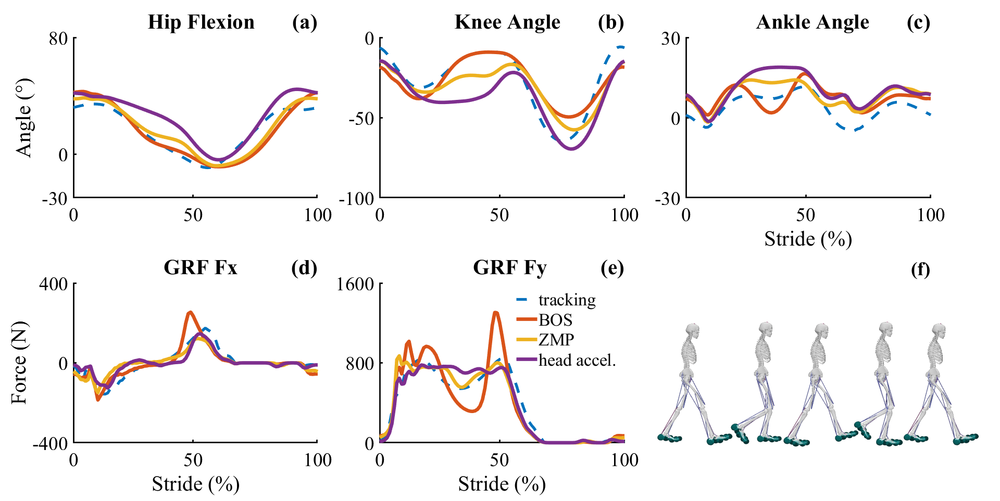

# Summary

MocoExtendProblem (`MEP`) is a more convenient MATLAB framework for prototyping and 
developing direct collocation goals for OpenSim Moco. `MEP` features several tools 
for testing and prototyping and using novel MocoGoals without resorting to rebuilding 
all of opensim or generating an .omoco file from C++ and loading the problem into MATLAB. 
Instead, users can structure their custom goals, build these with the visual studio and 
the MEX compiler and add them to existing MATLAB scripts.

This repository features:

- A set of C++ and MATLAB scripts and models for prototyping and testing custom goals.
- a build.m script that compiles goals in the custom_goals or custom_goals45 and procedurally constructs the c++/MATLAB and compiles the MEX interface.
- Compatibility with OpenSIm 4.2-4.4  and 4.5.
- The ability to include `MEP` as a submodule, build, and use valid custom goals.
- Custom goals previously developed in our labs are in the custom_goals directory.


# Statement of need

OpenSim is an open-source software platform for biomechanical modeling and simulation [@Seth2018]. The platform enables researchers and healthcare professionals to investigate how biological and non-biological structures respond to different loads, postures and activities. It has been used to study a wide range of biomechanical problems, such as the mechanics of walking and running [@Falisse2019], the impact of injury or disease on movement [@Johnson2022], and the effectiveness of rehabilitation exercises [@Spomer2023]. 


Direct collocation is a numerical optimization method used in dynamic systems and control engineering. It involves representing the system dynamics as a set of algebraic equations, which are then discretized over time, and solved as a nonlinear optimization problem to obtain the optimal control inputs. The method aims to find a numerical solution that satisfies the system constraints and optimizes a performance measure. Optimization paradigms like direct collocation have begun to play a critical role in expanding our understanding of biological locomotion through the in-silico testing of novel therapies and predictive capabilities.  

Within OpenSim is the software toolkit Moco [@Dembia2020], which employs direct collocation with the interior-point optimizer IPOPT [@Wchter2006] in order to solve trajectory optimization problems that could range from tracking experimental motion capture data for solving generalized coordinates, actuator controls, and kinetics to fully predictive simulations. Moco employs CasADi [@Andersson2018] to transform MocoProblems consisting of control goals and constraints into sets of matrices for nonlinear optimization. While direct collocation is powerful and OpenSim can be used to generate a broad range of dynamically-consistent simulations, it can be daunting for some users to modify and rebuild novel direct collocation goals. 

We developed `MEP` so researchers, clinicians, and students without experience compiling C++ can still write and test custom goals. By contrast, OpenSim’s interfaces for MATLAB are developed using SWIG, as opposed to MEX, which can be daunting for even seasoned biomechanists. Running build.m will compile custom goals developed and placed in the custom_goals directory, or if using OpenSim 4.5, `MEP` will search the custom_goals45. This distinction for pre- and post- 4.5 `MEP` is to handle where scaling arguments are moved to the abstract MocoGoal.

No further modifications to CMakeLists.txt are required; however cmake and msbuild.exe from Visual Studio 2019 or higher needs to be added to the system PATH. MocoExtendProblem was designed for use in matlab versions 2022a or igher. Presumably, the framework can be finessed to run on GNU Octave instead of matlab; however, this has not been tested. build.m will procedurally construct both extend_problem.m and ExtendProblem.cpp by parsing the header files of the discovered goals within the custom_goals directory. Both ExtendProblem.cpp and extend_problem.m generate bindings to instantiate custom goals placed in the custom_goals directory. Custom Goals will be compiled with VS2019+ and then MATLAB’s MEX compiler is used to compile the MEX function. ExtendProblem.cpp leverages the C++ library mexplus [@Yamaguchi2018] to gain access to MEX entry points entry and exit points through C++  macros.


To incorporate extend_problem goals into an existing script, a C-style pointer to the instantiated MocoProblem is passed as a constructor argument to the extend_problem.m class that wraps the `MEP` MEX. Class methods of extend_problem.m (\autoref{fig:files}; blue) are then used to add custom goals to the MocoProblem. 


To create a new goal with `MEP`: 

  1. copy one of the goals in the custom_goals folder.
  2. rename all files to that of your custom goal’s name.
  3. regex replace (or by hand) mentions of the original copied goal name to that of your goal’s name in each of the 5 files, being careful to also modify the include guards in the dll and register types header files.
  4. Reimplement initializeOnModelImpl, calcIntegrandImpl, calcGoalImpl such that they describe your custom goal.

In order to run a new custom goal, obtain the C-style pointer from OpenSim’s existing SWIG interface and pass this as a constructor argument to extend_problem.

```MATLAB
cptr = uint64(problem.getCPtr(problem));
ep = extend_problem(cptr);
ep.addMocoCustomGoal('custom_goal',weight,power,divide_by_distance);
```

This paradigm has implications for OpenSim and MATLAB developers beyond the scope of just incorporating novel MocoGoals; these same tools can be used to develop other tools or expand other classes and easily incorporate them into existing MATLAB-OpenSim scripts. We have posted all tools, instructions and simulation results related to this project on GitHub and SimTK.org/MEP. 

# Showcases

To demonstrate the utility of this framework, we utilized a two-dimensional (2-D) full-body human musculoskeletal model operated through the MATLAB-OpenSim API to simulate a half walking gait cycle [@Denton2023]. The base code uses Moco’s built-in MocoControlEffortGoal and MocoAverageSpeedGoal to generate tracking and predictive simulations of a dynamically-consistent walking step that minimizes the sum of the squared control effort, at an average speed of 1.3 m s-1. Additionally each objective function has an implicit acceleration minimization and auxiliary derivative cost term which help to smooth model kinetics and remove transient oscillations in ground reaction forces. 

Since Moco lacks any built-in gait stability goals, we developed three custom stability goals using `MEP` to prototype and compile into a new extend_problem class that adds these to an existing MocoProblem. The first is a base of support (BOS) criterion in  which the center of mass is optimized to lay between the average of the two mass centers for the calcaneus projected to the ground reference frame, the second is a zero-moment-point goal (ZMP) criterion that assumes the model is an inverted pendulum and the center of mass tracks the computed zero-tilting moment location, and the third is a marker acceleration minimization goal (ACCmarker) that minimizes the explicit accelerations of the marker’s station location.

`MEP`’s build.m was used to generate an extendproblem.cpp and extend_problem.m class which wraps the custom goal to create a new, multi-objective function based on the sum of squared control effort + stability criteria, such that: 

\begin{equation}\label{eq:cost_bos}
J_{BOS} = W_1 EFF^{2} + W_2 ACC_{smoothing} + W_3 BOS
\end{equation}

\begin{equation}\label{eq:cost_zmp}
J_{zmp} = W_1 EFF^{2} + W_2 ACC_{smoothing} + W_3 ZMP
\end{equation}

\begin{equation}\label{eq:cost_acc}
J_{acc} = W_1 EFF^{2} + W_2 ACC_{smoothing} + W_3 ACC_{marker}
\end{equation}

The results of each multi-objective predictive simulation, in which the stability criterion was compiled using `MEP`, is shown against the results from a tracking simulation \autoref{fig:stability}. The tracking simulation objective cost was a weighted sum of the tracking error (i.e. squared sum of simulation from experimental kinematic and ground reaction force data) and sum of the squared control efforts. 



|             | Objective cost | Effort  cost | Smoothing cost | Stability  cost |
|:-----------:|:--------------:|:------------:|:--------------:|:---------------:|
|  $J_{BOS}$  |    3.048285    |   2.234377   |    0.008309    |     0.795659    |
|  $J_{ZMP}$  |    3.384394    |   2.679968   |    0.008816    |     0.686290    |
| $J_{accel}$ |    3.814449    |   3.680096   |    0.010208    |     0.114528    |

Table: Objective cost and term breakdown for three predictive simulations using `MEP`.

`MEP` is being used in ongoing research  [@Joshi2023; @Sundararajan2023] of locomotor performance in humans and other animals. For validating `MEP`’s results, after solving each optimal control problem, a test is done to verify if the output MocoSolution numerically equals an output reference of the same problem and weights to within a tolerance based on the model’s assembly error tolerance.

#Funding

This work was supported by the National Science Foundation (BCS 2018436 and BCS 2018523)

# References